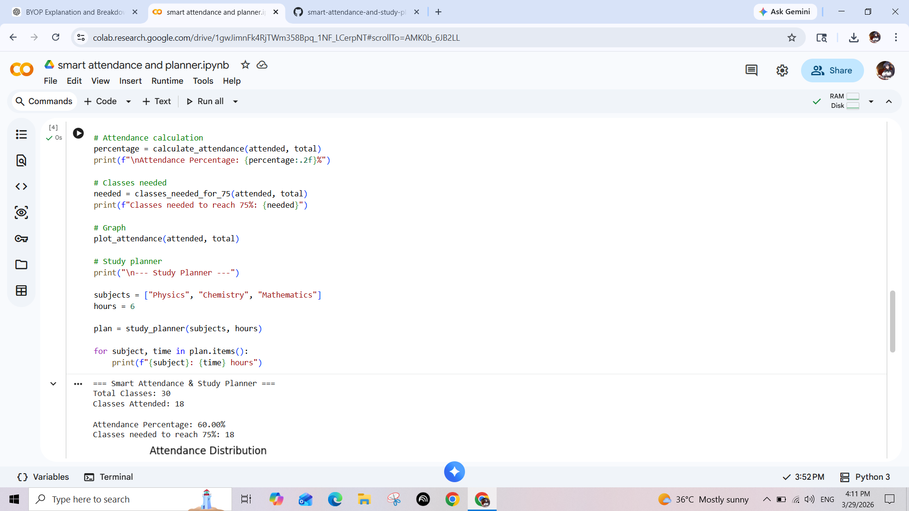
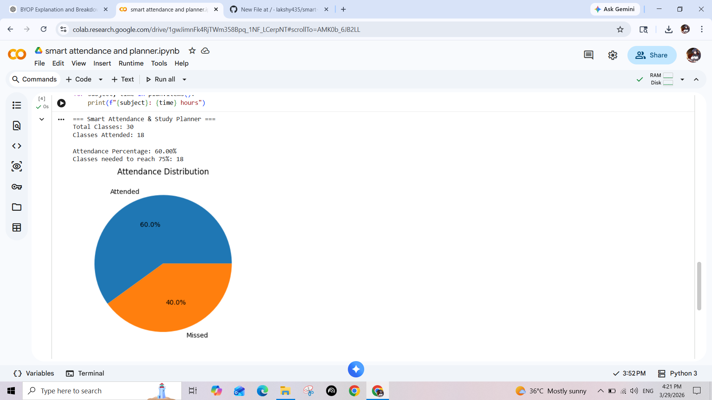

# Smart Attendance & Study Planner

## Introduction
This project is a Python-based tool designed to help students manage their attendance and study schedule effectively. It calculates attendance percentage, predicts the number of classes required to reach 75%, and generates a simple study plan.

---

## Problem Statement
Students often face difficulty in tracking their attendance and ensuring they meet the minimum 75% requirement. Additionally, managing study time across multiple subjects can be challenging.

---

## Solution
This project provides a simple solution by:
- Calculating attendance percentage
- Predicting required classes to reach 75%
- Displaying attendance distribution using a graph
- Generating a study plan

---

## Project Implementation
The project is implemented using Python and includes:
- Functions for modular programming
- Mathematical calculations for attendance
- Graph visualization using matplotlib

---

##  Project Notebook

You can view and run the complete project here:
https://colab.research.google.com/drive/1gwJimnFk4RjTWm358Bpq_1NF_LCerpNT?usp=sharing

---

## Output
The program produces:
- Attendance percentage
- Number of classes required
- Pie chart visualization
- Study plan for subjects
  
---

## Screenshots

---

## Conclusion
This project demonstrates how Python can be used to solve real-life student problems like attendance tracking and study planning. It is simple, effective, and easy to use.

---

## Learning Outcomes
- Understanding of Python functions and logic
- Basic data visualization
- Real-world problem solving using programming
